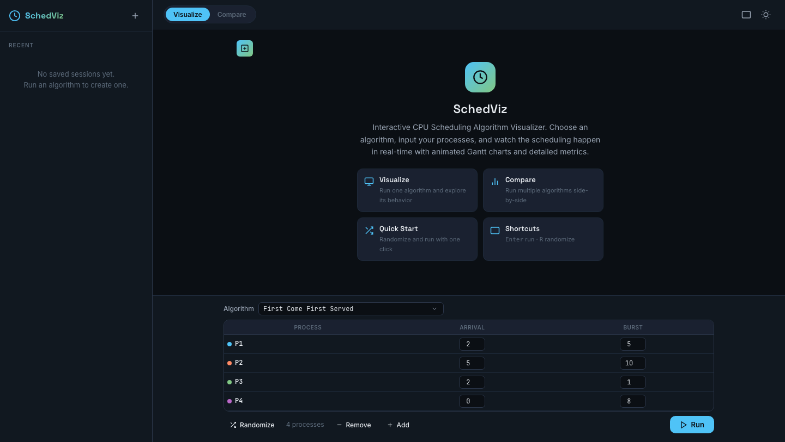
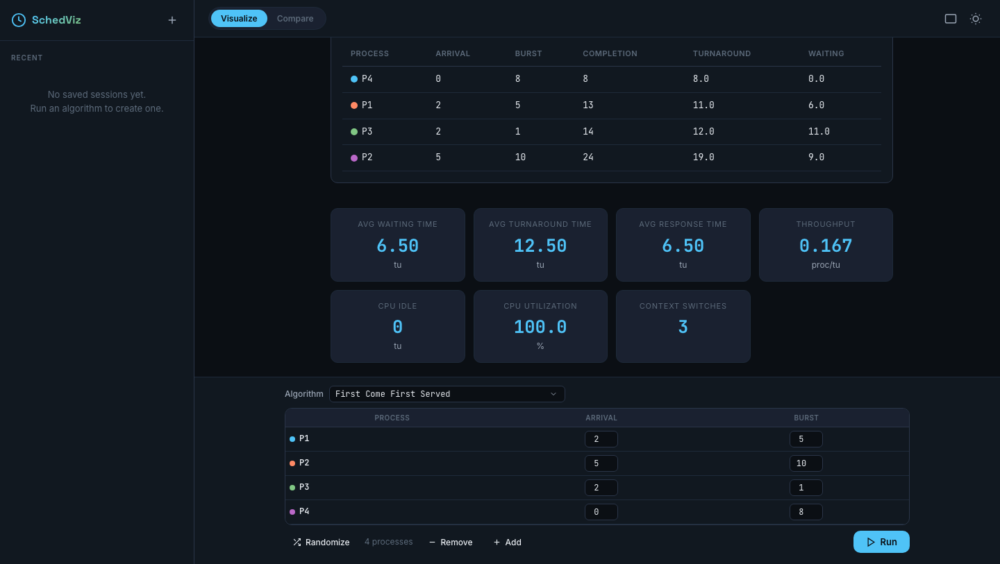
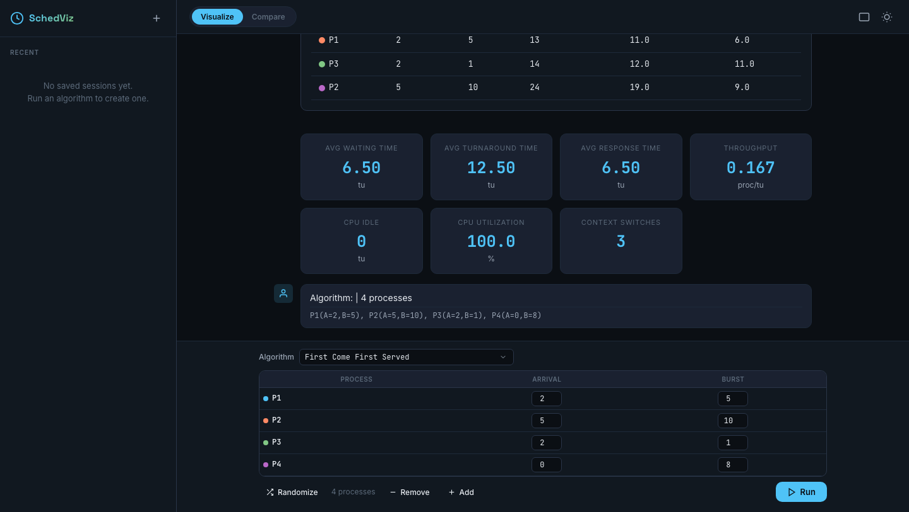
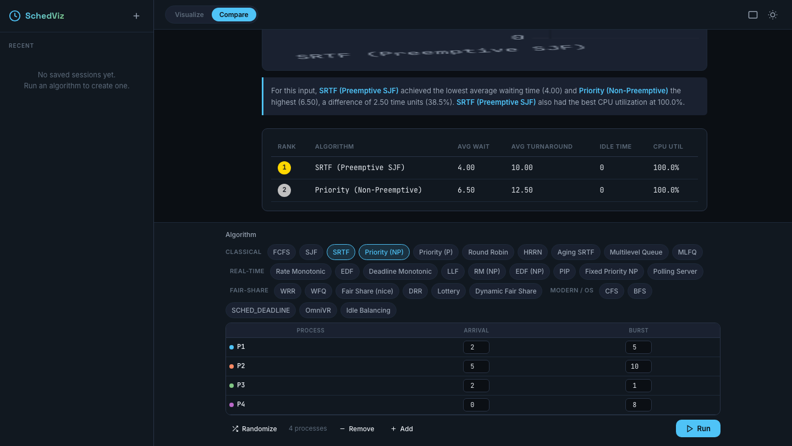

# SchedViz — CPU Scheduling Algorithm Visualizer

An interactive, modern web application for visualizing and comparing 30 CPU scheduling algorithms — built for university operating systems courses.



---

## Live Demo

**[https://azimpial.github.io/CPU-Scheduling-Algorithm/](https://azimpial.github.io/CPU-Scheduling-Algorithm/)**

---

## What It Does

SchedViz lets you **configure a set of processes**, pick a scheduling algorithm (or compare several at once), and instantly see:

- An **animated Gantt chart** showing exactly when each process runs
- A **results table** with waiting time, turnaround time, response time, throughput, and CPU utilization
- A **step-by-step trace** you can play, pause, or step through manually
- In **Compare Mode** — bar charts, auto-generated verdicts, and ranked results across algorithms

---

## Screenshots

### FCFS — Result View


### Round Robin — Result View


### Compare Mode — Side-by-Side Analysis


---

## Features

- **Chat-based UI** — Conversational interface, intuitive and clean
- **30 Scheduling Algorithms** — Classical, Real-Time, Fair-Share, and Modern/OS
- **Dynamic Process Input** — Add or remove processes on the fly; per-algorithm custom fields
- **Animated Gantt Charts** — Staggered block animations for visual clarity
- **Step-by-step Trace** — Play / Pause / Step through schedules with live ready-queue visualization
- **Comparative Analysis** — Side-by-side Gantt charts, bar charts, and auto-verdicts
- **Real-Time Scheduling** — Periodic task model with deadline-miss detection over the hyperperiod
- **Rich Metrics** — Avg waiting / turnaround / response time, throughput, CPU utilization, context switches
- **Dark / Light Theme** — Toggle with full persistence, no flash of unstyled content
- **Export** — Download results as CSV or Gantt charts as PNG
- **Shareable URLs** — Encode scenarios in a URL
- **Saved Sessions** — Sidebar history with localStorage persistence
- **Fully Responsive** — Works on desktop and mobile
- **Keyboard Shortcuts** — `Enter` to run, `R` to randomize, `Esc` to close modals
- **Accessibility** — ARIA labels, focus-visible rings, reduced-motion support
- **Print Stylesheet** — Clean report view for printing or saving as PDF

---

## Algorithms Implemented

### Classical (10)

| Algorithm | Type | Description |
|-----------|------|-------------|
| FCFS | Non-Preemptive | Processes run in arrival order — simplest and fair |
| SJF | Non-Preemptive | Shortest burst first — optimal for avg waiting time |
| SRTF | Preemptive | Shortest remaining time — globally optimal for avg wait |
| Priority (NP) | Non-Preemptive | Scheduled by priority value |
| Priority (P) | Preemptive | Highest priority always preempts |
| Round Robin | Preemptive | Fair time-sharing with configurable quantum |
| HRRN | Non-Preemptive | Highest Response Ratio Next — avoids starvation |
| Aging SRTF | Preemptive | SRTF with waiting-time aging to prevent starvation |
| Multilevel Queue | Mixed | 2-level: RR foreground + FCFS background |
| MLFQ | Preemptive | 3-level feedback queue with priority boost |

### Real-Time (9)

| Algorithm | Type | Description |
|-----------|------|-------------|
| Rate Monotonic | Fixed Priority | Priority assigned by period (shorter = higher) |
| EDF | Dynamic Priority | Earliest absolute deadline runs first |
| Deadline Monotonic | Fixed Priority | Priority by relative deadline |
| Least Laxity First | Dynamic Priority | Smallest laxity (slack) runs first |
| RM (Non-Preemptive) | Fixed Priority | Rate Monotonic without preemption |
| EDF (Non-Preemptive) | Dynamic Priority | Earliest Deadline First without preemption |
| Priority Inheritance | Fixed Priority | Bounds priority inversion through inheritance |
| Fixed Priority NP | Fixed Priority | Explicit priority, non-preemptive |
| Polling Server | Server | Periodic server for aperiodic job handling |

### Fair-Share (6)

| Algorithm | Type | Description |
|-----------|------|-------------|
| Weighted Round Robin | Weighted RR | Time slice proportional to weight |
| Weighted Fair Queuing | Virtual-Time | Simulates bit-by-bit round robin fairness |
| Fair Share (nice) | Weighted | CPU weight derived from Unix nice value |
| Deficit Round Robin | Weighted RR | Deficit counters for exact fairness |
| Lottery | Probabilistic | Weighted random ticket draws for scheduling |
| Dynamic Fair Share | Weighted | Weight + nice with waiting-time aging |

### Modern / OS (5)

| Algorithm | Type | Description |
|-----------|------|-------------|
| CFS | Fair Share | Linux Completely Fair Scheduler — vruntime fairness |
| BFS | Fair Share | BrainFuck Scheduler — virtual-deadline interactive model |
| SCHED_DEADLINE | Real-Time | Linux EDF-based real-time scheduling class |
| OmniVR | Hybrid | Priority + deadline-urgency ranking |
| Idle Balancing | Fair Share | Least-served-first load-balanced queue |

> **Note:** MLQ/MLFQ, WFQ, CFS, BFS, SCHED_DEADLINE, OmniVR, Polling Server, and Priority Inheritance are **faithful educational simulations** — assumptions are documented in each algorithm's Info panel.

---

## Tech Stack

| Layer | Technology |
|-------|-----------|
| Markup | HTML5 |
| Styling | CSS3 (custom properties, flexbox, CSS grid) |
| Logic | Vanilla JavaScript (ES2022) |
| Charts | Chart.js v4 (comparison bar charts only) |
| Fonts | Space Grotesk, Inter, JetBrains Mono (Google Fonts) |
| Build | **None** — zero dependencies, zero bundler |
| Runtime | 100% client-side, no backend required |

---

## Project Structure

```
├── index.html                  ← Single-page app shell
├── package.json                ← npm test harness only
├── assets/
│   ├── css/
│   │   ├── base.css            ← Design tokens, reset, typography, themes
│   │   ├── components.css      ← Buttons, forms, cards, tables, modals
│   │   ├── gantt.css           ← Gantt chart styles and animations
│   │   ├── chat.css            ← Chat UI, sidebar, input bar, messages
│   │   └── landing.css         ← Welcome screen styles
│   ├── js/
│   │   ├── algorithms/         ← 30 pure scheduling functions
│   │   ├── core/               ← Shared utilities and engines
│   │   │   ├── types.js        ← Algorithm registry, categories, validation
│   │   │   ├── validators.js   ← Per-field and per-algorithm validation
│   │   │   ├── metrics.js      ← Response time, throughput, aggregates
│   │   │   ├── engine.js       ← Reusable event-driven scheduling engine
│   │   │   └── rtEngine.js     ← Periodic real-time / hyperperiod engine
│   │   ├── ui/                 ← UI components
│   │   │   ├── processForm.js  ← Dynamic, field-driven process table
│   │   │   ├── ganttRenderer.js
│   │   │   ├── resultsTable.js
│   │   │   ├── inputBar.js     ← Category-grouped algorithm picker
│   │   │   ├── chatThread.js
│   │   │   ├── sidebar.js
│   │   │   ├── modal.js        ← Info panels for all 30 algorithms
│   │   │   └── theme.js
│   │   └── app.js              ← Main application controller
│   └── screenshots/            ← README images
└── tests/
    └── run.mjs                 ← Dependency-free test suite
```

---

## Getting Started

### Run Locally

Because the app uses **ES modules** (`<script type="module">`), browsers block it from loading via `file://`. Serve over HTTP:

```bash
# Python 3
python3 -m http.server 8000
# → open http://localhost:8000

# Node.js
npx serve .
```

### Run Tests

```bash
npm test        # or: node tests/run.mjs
```

Verifies result-shape validity for all 30 algorithms, textbook regressions (SJF order, RR slices, FCFS times, HRRN order), SRTF optimality, EDF feasibility/deadline detection, WFQ/CFS weighting, and lottery determinism.

---

## Deploy to GitHub Pages

1. Push the repository to GitHub.
2. Go to **Settings → Pages**.
3. Under *Build and deployment*, set Source to **Deploy from a branch**.
4. Select branch `main`, folder `/ (root)`, then **Save**.
5. The site will be live at `https://azimpial.github.io/CPU-Scheduling-Algorithm/` within a few minutes.

No build step required — this is a static HTML/CSS/JS site.

---

## Contributors

| Contributor | Role |
|-------------|------|
| **[Azim Pial](https://github.com/AzimPial)** | Project Lead, Core Development |
| **[Naayma Sultana](https://github.com/NaaymaSultana)** | Contributor |

---

## License

MIT
